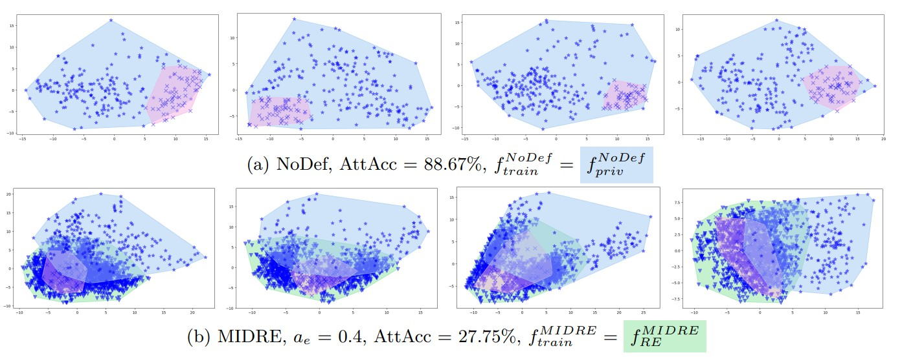
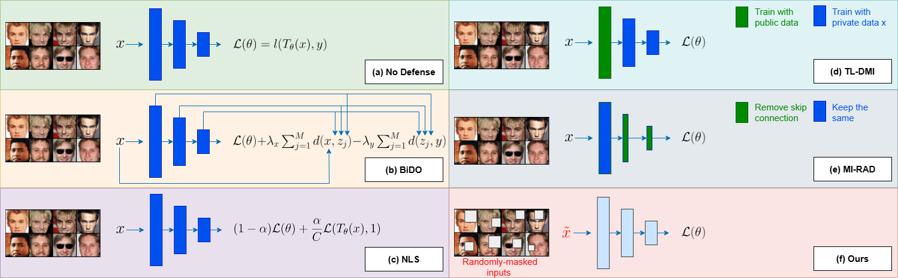

# Random Erasing vs. Model Inversion: A Promising Defense or a False Hope? (TMLR 2025)
Viet-Hung Tran, Ngoc-Bao Nguyen, Son T. Mai, Hans Vandierendonck, Ira Assent, Alex Kot, Ngai-Man Cheung

(*) The first two authors contributed equally.
  <center>
  
  </center>

> **Abstract:**
> *Model Inversion (MI) attacks pose a significant privacy threat by reconstructing private training data from machine learning models. While existing defenses primarily concentrate on model-centric approaches, the impact of data on MI robustness remains largely unexplored. In this work, we explore Random Erasing (RE), a technique traditionally used for improving model generalization under occlusion, and uncover its surprising effectiveness as a defense against MI attacks. Specifically, our novel feature space analysis shows that models trained with RE-images introduce a significant discrepancy between the features of MI-reconstructed images and those of the private data. At the same time, features of private images remain distinct from other classes and well-separated from different classification regions. These effects collectively degrade MI reconstruction quality and attack accuracy while maintaining reasonable natural accuracy. Furthermore, we explore two critical properties of RE including Partial Erasure and Random Location. Partial Erasure prevents the model from observing entire objects during training. We find this has a significant impact on MI, which aims to reconstruct the entire objects. Random Location of erasure plays a crucial role in achieving a strong privacy-utility trade-off. Our findings highlight RE as a simple yet effective defense mechanism that can be easily integrated with existing privacy-preserving techniques. Extensive experiments across 37 setups demonstrate that our method achieves state-of-the-art (SOTA) performance in the privacy-utility trade-off. The results consistently demonstrate the superiority of our defense over existing methods across different MI attacks, network architectures, and attack configurations. For the first time, we achieve a significant degradation in attack accuracy without a decrease in utility for some configurations.*  
[Full Paper (PDF)](https://arxiv.org/abs/2409.01062)

## Model Inversion Defense
  <center>
  
  </center>

# Setup and Run Attacks
## Install
```
conda create --name midre python=3.10 -y
conda activate midre

pip install -r requirements.txt

```

## Setup StyleGAN2
Clone the official [StyleGAN2-ADA-Pytorch](https://github.com/NVlabs/stylegan2-ada-pytorch):

```
git clone https://github.com/NVlabs/stylegan2-ada-pytorch.git
rm -r --force stylegan2-ada-pytorch/.git/
rm -r --force stylegan2-ada-pytorch/.github/
rm --force stylegan2-ada-pytorch/.gitignore

wget https://nvlabs-fi-cdn.nvidia.com/stylegan2-ada-pytorch/pretrained/ffhq.pkl -P stylegan2-ada-pytorch/

```

## Prepare Datasets
We support [FaceScrub](http://vintage.winklerbros.net/facescrub.html), [CelebA](https://mmlab.ie.cuhk.edu.hk/projects/CelebA.html) and [Stanford Dogs](http://vision.stanford.edu/aditya86/ImageNetDogs/) as datasets to train the target models. Please follow the instructions on the websites to download the datasets. 
Replace the ```root``` of dataset, for examples  ```datasets/facescrub.py```
Make sure that the following structure is kept:

  
    ├── celeba
        ├── img_align_celeba
        ├── identity_CelebA.txt
        ├── list_attr_celeba.txt
        ├── list_bbox_celeba.txt
        ├── list_eval_partition.txt
        ├── list_landmarks_align_celeba.txt
        └── list_landmarks_celeba.txt
    ├── facescrub
        ├── actors
            ├── faces
            └── images
        └── actresses
            ├── faces
            └── images
    ├── stanford_dogs
        ├── Annotation
        ├── Images
        ├── file_list.mat
        ├── test_data.mat
        ├── test_list.mat
        ├── train_data.mat
        └── train_list.mat

## Train the Defense Models
We provide an example configuration file with detailed explanations at:
```configs/training/targets/ResNet18_FaceScrub_midre_0.4.yaml```. You can customize the training by adjusting parameters such as the ```scale``` value in the ```RandomErasing``` section.

Once the configuration file is ready, start the training process using the following command:

```bash
python train_model.py -c=configs/training/targets/ResNet18_FaceScrub_midre.yaml
```
After the optimization completes, the model is automatically evaluated. All outputs are logged to WandB.

## Evaluate the effectiveness of MIDRE

To evaluate the effectiveness of our defense, we provide [PPA attack](https://github.com/LukasStruppek/Plug-and-Play-Attacks). An example configuration file with detailed explanations can be found at:
```configs/attacking/FaceScrub_FFHQ_resnet18_midre.yml```.
Make sure to update ```weights``` in the configuration to the directory of your trained defense model.


```bash
python attack.py -c=configs/attacking/FaceScrub_FFHQ_resnet18_midre.yml

```

Results and metrics are logged to WandB for convenient tracking and comparison.

## Our pre-trained defense models 

Our pre-trained model can be downloaded at [FaceScrub](https://github.com/ngoc-nguyen-0/MIDRE_TMLR/releases/)

## Citation
If you build upon our work, please don't forget to cite us.
```
@article{
tran2025random,
title={Random Erasing vs. Model Inversion: A Promising Defense or a False Hope?},
author={Viet-Hung Tran and Ngoc-Bao Nguyen and Son T. Mai and Hans Vandierendonck and Ira Assent and Alex Kot and Ngai-Man Cheung},
journal={Transactions on Machine Learning Research},
issn={2835-8856},
year={2025},
url={https://openreview.net/forum?id=S9CwKnPHaO},
note={Featured Certification}
}

```

## Implementation Credits
Some components of our implementation build upon existing public repositories. We sincerely thank the authors for making their code available:
- PPA: https://github.com/LukasStruppek/Plug-and-Play-Attacks
- FID Score: https://github.com/mseitzer/pytorch-fid
- Stanford Dogs Dataset Class: https://github.com/zrsmithson/Stanford-dogs
- FaceNet: https://github.com/timesler/facenet-pytorch
- Negative Label Smoothing: https://github.com/UCSC-REAL/negative-label-smoothing
